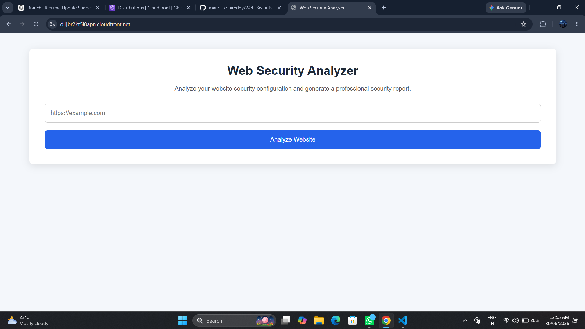
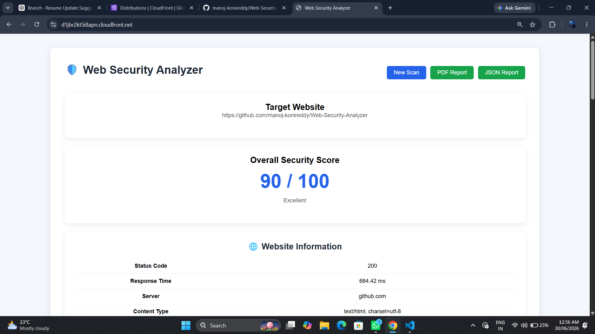
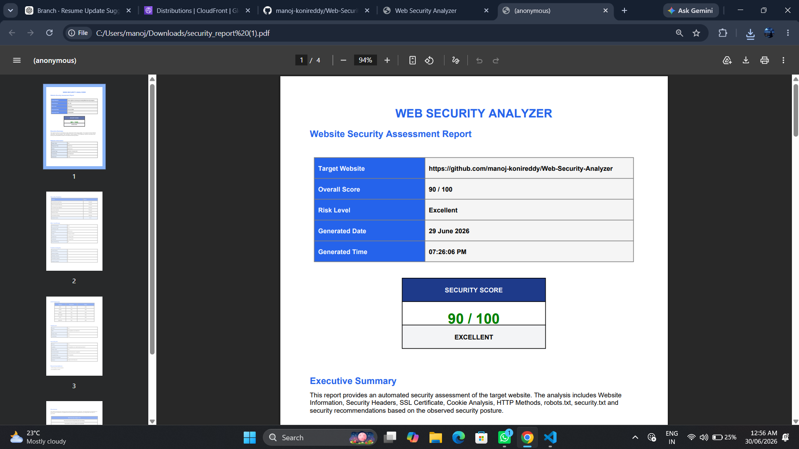

# 🔒 Web Security Analyzer



A lightweight web security tool built with Python and Flask that analyzes websites for common security misconfigurations, insecure HTTP headers, SSL/TLS configuration, cookie security, and HTTP methods.

The application generates a security risk score and exports professional PDF and JSON security reports. It is deployed on AWS using EC2, Nginx, Gunicorn, and CloudFront with HTTPS.

---

# 🌐 Live Demo

### 🔗 https://d1jbr2kt5i8apn.cloudfront.net

---

# 🎯 Objective

The objective of this project is to perform automated reconnaissance and security assessment of publicly accessible websites by analyzing their security posture and identifying potential weaknesses.

This tool helps developers, students, and security enthusiasts understand whether a website follows modern web security best practices.

---

# 🔍 Security Checks

## SSL/TLS Analysis

- HTTPS Availability
- SSL Certificate Validation
- Certificate Expiry Status

---

## HTTP Security Headers

- Content-Security-Policy
- Strict-Transport-Security (HSTS)
- X-Frame-Options
- X-Content-Type-Options
- Referrer-Policy
- Permissions-Policy

---

## Cookie Security

- Secure Flag
- HttpOnly Flag
- SameSite Attribute

---

## Web Configuration

- robots.txt Detection
- security.txt Detection
- Allowed HTTP Methods
- Website Reachability

---

## Risk Assessment

The application evaluates every security check and calculates an overall security score.

Example

```
Security Score : 84 / 100

Risk Level : Low

Recommendation :
Enable Content Security Policy
Enable HSTS
Restrict HTTP Methods
```

---

# 📄 Report Generation

The application generates

- Professional PDF Security Report
- JSON Security Report

Reports include

- Executive Summary
- Website Information
- SSL Details
- Security Headers
- Cookie Analysis
- HTTP Methods
- Security Recommendations
- Overall Risk Score

---

# ⚙️ Technology Stack

## Programming

- Python

## Backend

- Flask

## Security Libraries

- Requests
- BeautifulSoup

## Report Generation

- ReportLab

## Deployment

- AWS EC2
- Amazon Linux 2023
- Gunicorn
- Nginx
- AWS CloudFront

## Version Control

- Git
- GitHub

---

# ☁️ AWS Deployment Architecture

```
                User
                  │
              HTTPS
                  │
          AWS CloudFront
                  │
              HTTP
                  │
               Nginx
                  │
             Gunicorn
                  │
              Flask App
                  │
          Security Scanner
```

---

# 🚀 Installation

Clone the repository

```bash
git clone https://github.com/manoj-konireddy/Web-Security-Analyzer.git
```

Navigate to project

```bash
cd Web-Security-Analyzer
```

Create virtual environment

```bash
python -m venv venv
```

Activate

Windows

```bash
venv\Scripts\activate
```

Linux

```bash
source venv/bin/activate
```

Install dependencies

```bash
pip install -r requirements.txt
```

Run

```bash
python app.py
```

Open

```
http://127.0.0.1:5000
```

---

## 📂 Project Structure

```
Web-Security-Analyzer/
│
├── modules/
│   ├── export_report.py
│   ├── headers.py
│   ├── cookies.py
│   ├── ssl_checker.py
│   ├── http_methods.py
│   ├── risk.py
│   └── ...
│
├── reports/
│
├── static/
│   ├── style.css
│   └── script.js
│
├── templates/
│   ├── index.html
│   ├── report.html
│   └── base.html
│
├── app.py
├── scanner.py
├── config.py
├── requirements.txt
├── README.md
└── LICENSE
```

---

# 📸 Screenshots

### Home Page


---

### Security Report



---

### Generated PDF



---

# Future Improvements

- DNS Security Analysis
- WHOIS Lookup
- CVE Integration
- Vulnerability Database
- Subdomain Enumeration
- SSL Cipher Analysis
- HTTP/2 Detection
- Security Dashboard
- Scan History
- Authentication

---

# Deployment

- AWS EC2
- Gunicorn
- Nginx Reverse Proxy
- CloudFront CDN
- HTTPS Enabled

---

# Author

**Konireddy Manoj Kumar Reddy**

GitHub

https://github.com/manoj-konireddy

LinkedIn

https://linkedin.com/in/manoj-konireddy

Portfolio

https://manoj-konireddy.github.io/portfolio

---

## ⭐ Support

If you found this project useful, please consider giving it a ⭐ on GitHub.